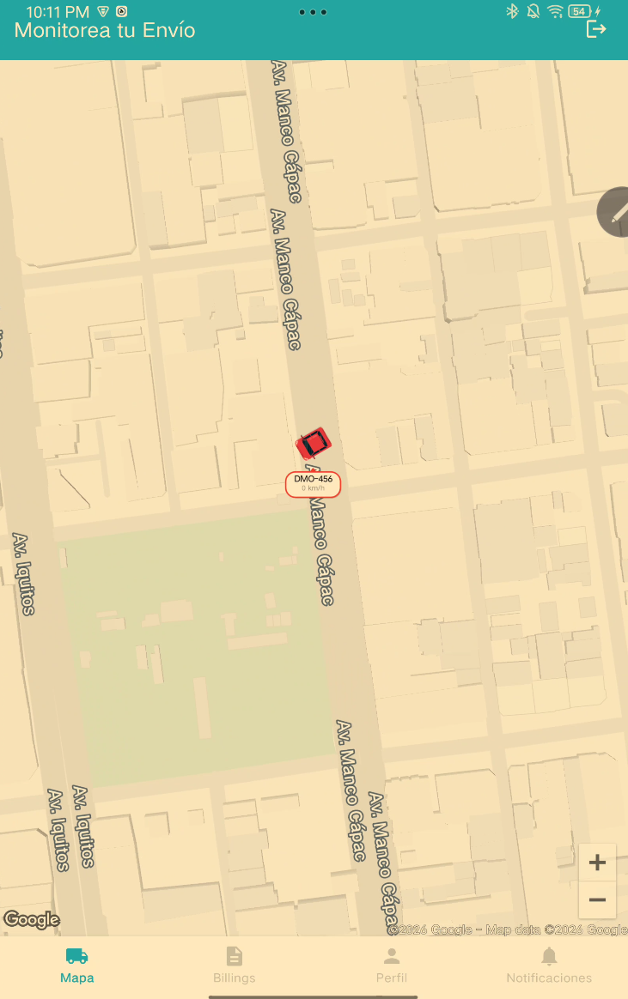

# ShipmentMonitor

Android native app for real-time shipment tracking and monitoring — built as a technical assessment for 24Labs.

<p align="center">
  
</p>

## Quick start

1. Clone the repo and open in Android Studio
2. Add your Google Maps API key to `local.properties`:
   ```
   MAPS_API_KEY=AIzaSy...your_key_here
   ```
3. Add the SHA-1 of your signing key to your Google Cloud Console (Maps SDK for Android), restricted to package `com.kevinchambi.shipmentmonitor`
4. Build & run: `./gradlew assembleDebug`

APK output: `app/build/outputs/apk/debug/app-debug.apk`

## Screens

| Screen | Description |
|--------|-------------|
| Login | Email/password auth with "keep session" checkbox |
| Forgot Password | Reset password via API |
| Map | Google Maps with custom markers showing vehicles (plate, speed, color by status, rotation by angle) |
| Notifications | RecyclerView list of shipment status updates with delete |
| Billings | Placeholder |
| Profile | Placeholder |

## Architecture

```
shipmentmonitor/
├── data/
│   ├── model/          ← ApiResponse, Vehicle, Notification, LoginData, etc.
│   ├── network/        ← RetrofitClient, ApiService, AuthInterceptor
│   └── repository/     ← Auth, Vehicle, Notification repositories
├── ui/
│   ├── auth/           ← LoginFragment, ForgotPasswordFragment, AuthViewModel
│   ├── map/             ← MapFragment, MapViewModel
│   ├── billings/        ← BillingsFragment (placeholder)
│   ├── profile/         ← ProfileFragment (placeholder)
│   └── notifications/   ← NotificationsFragment, NotificationAdapter, NotificationsViewModel
├── utils/
│   ├── MarkerUtils.kt  ← Canvas-based custom map markers
│   └── SessionManager.kt ← SharedPreferences token persistence
├── ShipmentMonitorApp.kt ← Application class (initializes RetrofitClient)
└── MainActivity.kt       ← NavHost + BottomNavigation
```

**Pattern:** MVVM with Repository. ViewModels expose `LiveData`, Fragments observe and render.

## API integration

| Endpoint | Method | Auth |
|----------|--------|------|
| `/auth/login` | POST | No |
| `/auth/forgot` | POST | No |
| `/vehicles` | GET | Bearer token |
| `/notifications` | GET | Bearer token |

Base URL: `https://demoapp2026.alwaysdata.net/api/v1/`

Authentication uses a Bearer token returned on login, stored in `SharedPreferences` via `SessionManager`. The `AuthInterceptor` attaches it to all requests except login and forgot-password.

## Tech stack

| Layer | Technology |
|-------|-----------|
| Language | Kotlin |
| Min SDK | 26 |
| Target SDK | 36 |
| Build | Gradle Kotlin DSL, AGP 9.2.1 |
| UI | Material Design, ViewBinding, Navigation Component |
| Maps | Google Maps SDK (MapView) |
| Network | Retrofit 2.11 + OkHttp 4.12 + Gson |
| Async | Kotlin Coroutines + LiveData |
| Architecture | MVVM + Repository pattern |

## Color palette

| Color | Hex | Usage |
|-------|-----|-------|
| Azul oscuro | `#0041BA` | Primary buttons, text highlights |
| Cyan | `#23B4D9` | Toolbar, bottom nav active, dates |
| Púrpura | `#9841D1` | Cancel button, secondary actions |
| Rojo | `#F00101` | Stopped markers, delete actions |
| Blanco | `#FFFFFF` | Backgrounds, text on dark |

## Key decisions

| Decision | Rationale |
|----------|-----------|
| MapView instead of SupportMapFragment | `SupportMapFragment` inside `NavHostFragment` causes lifecycle disconnection. `MapView` with manual lifecycle calls is reliable. |
| Canvas-based markers with zoom scaling | View-based markers don't render in map context (no Window attached). Pure Canvas drawing with density + zoom scaling. Car-only at low zoom (≤0.55), full marker with pill at higher zoom. Triangle connector unifies car and pill into a cohesive pin. No `BlurMaskFilter` (broken on offscreen bitmaps) — manual shadow via offset rect. |
| Repository unwraps ApiResponse | Repositories catch `HttpException`, parse error body, and return `Result<T>`. ViewModels receive clean types — no `ApiResponse` nesting. |
| Snackbar over Toast | Material Snackbar for all user-facing error messages. TextInputLayout errors for field validation. |
| AGP 9.x (no kotlin-android plugin) | AGP 9.x bundles Kotlin. Adding `kotlin-android` causes "Cannot add extension with name 'kotlin'" conflict. |

## Build

```bash
# Debug APK
./gradlew assembleDebug

# Install on connected device
./gradlew installDebug
```

## License

Technical assessment project — all rights reserved.